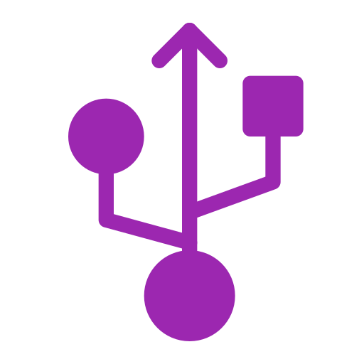

<div align="center">
	
</div>

# serial-kit

Cross-platform serial port library for Deno (Linux, macOS, Windows)

## Features
- List available serial ports on all major platforms
- Open, read, write, and close serial ports
- Native performance using Deno FFI
- Modern TypeScript API

## Installation


Add serial-kit to your Deno project:

```
import { SerialPort, SerialPortList } from "https://raw.githubusercontent.com/code-forge-temple/serial-kit/main/mod.ts";
```

## Usage Example

```ts
import { SerialPort, SerialPortList } from "https://raw.githubusercontent.com/code-forge-temple/serial-kit/main/mod.ts";

const ports = await new SerialPortList().list();

console.log("Detected ports:", ports);

const port = new SerialPort({
	path: ports[0].path,
	baudRate: 115200,
});

await port.write("AT\r\n");

const data = await port.read(1024);

console.log(new TextDecoder().decode(data));

port.close();
```

## Running Tests


serial-kit tests require permissions for FFI, file, and environment access:

```
deno test --allow-ffi --allow-read --allow-write --allow-env --env
```

## Project Structure
- `mod.ts` – Entry point, exports main API
- `src/serial/port/` – Serial port implementations (Windows, POSIX)
- `src/serial/list/` – Serial port enumeration
- `src/ffi/` – FFI bindings
- `tests/` – Test files

## License

This project is licensed under the GNU GPL v3. See the LICENSE file for details.